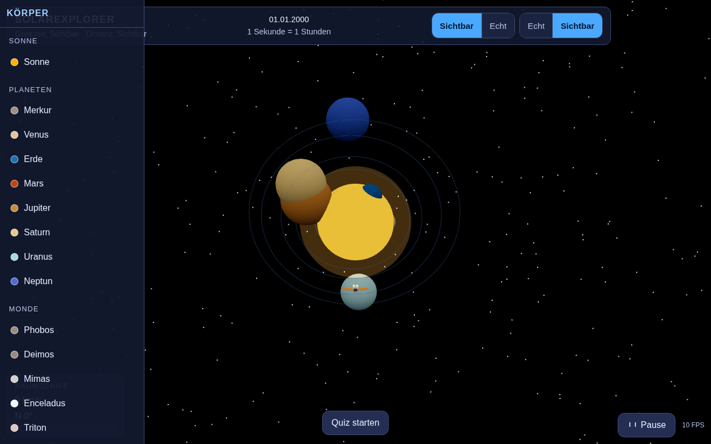

# SolarExplorer

Fliege mit einem kleinen Raumschiff durch unser Sonnensystem — und lerne
dabei jeden Planeten, jeden Mond und die Sonne kennen.



---

## Was ist das?

SolarExplorer ist ein Spielzeug *und* ein Lernprogramm in einer Webseite. Du
startest ein Raumschiff in der Nähe der Sonne, fliegst zu den Planeten und
Monden und schaust dir an, was dort los ist. Zu jedem Körper gibt es ein
Datenpanel mit einem **Kindtext**: nicht nur Zahlen, sondern eine Erklärung in
einfachen Worten.

SolarExplorer läuft komplett im Browser. Es gibt **keinen Server**, keine
Anmeldung, keine Internetverbindung nötig — alle Daten und alle Bilder liegen
im Programm selbst.

**Für wen?** Für Kinder ab etwa 8 bis 14 Jahren. Auch Erwachsene finden im
Quiz und in den Datenpanels genug zu entdecken.

---

## Was kannst du alles machen?

Alles hier ist wirklich eingebaut und getestet — nichts ist nur angekündigt.

### Die Welt erkunden

- **20 Himmelskörper** sind zu sehen: die Sonne, alle 8 Planeten und 11 Monde
  (Mond, Phobos, Deimos, Io, Europa, Ganymede, Kallisto, Titan, Enceladus,
  Mimas, Triton).
- **Echte Umlaufbahnen.** Die Planeten laufen nicht auf Kreisen, sondern auf
  Ellipsen — so wie in der Wirklichkeit. Man kann beim Anflug zusehen, wie
  sie sich bewegen.
- **Echte Umlaufzeiten.** Die Erde braucht 365 Tage, der Merkur nur 88. Die
  Simulation startet im Zeitraffer (1 Sekunde Echtzeit = 1 Stunde auf dem
  Kalender), damit man nicht Wochen wartet, bis sich etwas tut.
- **Ein Raumschiff zum Steuern.** Vorwärts, rückwärts, seitlich, hoch, runter,
  mit Turbo (Shift) und mit Maus oder Finger auf Tablets.
- **Die Kamera folgt dem Schiff** und schaut dabei leicht in Fahrtrichtung —
  wie in einem Cockpit.

### Umschalten und auswählen

- **Größenansicht** umschalten: „Sichtbar" (alles gut zu sehen) oder „Echt"
  (echte Größenverhältnisse — dann sieht man, wie winzig die Erde neben dem
  Jupiter wirklich ist).
- **Abstandsansicht** umschalten: „Sichtbar" oder „Echt" (echte Entfernungen).
- **Jeden Körper anklicken** in der Liste links — das Schiff fliegt hin, das
  Datenpanel öffnet sich.

### Der Lernteil

- **Datenpanel zu jedem Körper** mit: einem Kindtext („Das ist …"), einer
  spannenden Besonderheit, einem Steckbrief (Radius, Masse, Schwerkraft,
  Temperatur, Tages- und Jahreslänge, Bahnradius, Rotation, Achsneigung,
  Anzahl Monde, Atmosphäre, Entdeckung), einem Größenvergleich
  („So groß wie etwa 318 Erden") und einem Bereich „Mehr erfahren" mit einer
  Frage zum Nachdenken und der Antwort „Würdest du dort überleben?".
- **Lernquiz** mit 19 Fragen in drei Schwierigkeitsgraden. Jede Antwort
  bekommt sofort eine Rückmeldung mit Erklärung — auch die falschen.
- **Zahlen sind kindgerecht formatiert:** keine `1,496e+08 km`, sondern
  „1,496 Mrd. km". Negative Werte (rückwärts rotierende Planeten wie Venus
  und Uranus) sind als „rückwärts" gekennzeichnet.

---

## Schnellstart

Voraussetzung: Docker installiert.

```bash
docker compose up --build
```

Dann den Browser öffnen auf:

**http://localhost:8090**

Zum Stoppen:

```bash
docker compose down
```

Der erste Build dauert ein paar Minuten (dabei wird das Programm gebaut und
die Bilder werden erzeugt). Danach startet der Container in Sekunden.

---

## Steuerung

Die Tastatursteuerung hört auf der 3D-Fläche. Einmal in den dunklen
Weltraum klicken, dann fliegt das Schiff.

| Taste | Was passiert |
|---|---|
| **W** / **↑** | Vorwärts fliegen |
| **S** / **↓** | Rückwärts bremsen / rückwärts fliegen |
| **A** / **←** | Nach links steuern |
| **D** / **→** | Nach rechts steuern |
| **R** | Nach oben steuern |
| **C** | Nach unten steuern — beendet außerdem den Schub |
| **X** | Nach rechts zur Seite schieben |
| **Z** | Nach links zur Seite schieben |
| **Q** / **E** | Nase senken / heben |
| **Shift** (halten) | Turbo — 2,5-facher Schub |
| **M** | Schnellreise zum Merkur |
| **F** | Schnellreise zur Erde |
| **Leertaste** | Zeit anhalten und weiterlaufen lassen |
| **P** | Zeit anhalten und weiterlaufen lassen |
| **Q** | Quiz starten / beenden |
| **Esc** | Schiff zurück an den sicheren Startpunkt |

**Achtung, eine Doppelbelegung:** **Q** senkt das Schiff (Nick), startet aber
auch das Quiz. Das ist eine Altlast aus dem Zusammenbau und sollte später
getrennt werden — im Zweifel das Quiz über den Knopf unten in der Mitte
starten.

**Maus / Touch:** Ziehen mit gedrückter Maustaste (oder Finger) schaut um
herum. Auf Tablets und Handys lässt sich das Schiff ziehen.

---

## Wie ist das gebaut?

Für alle, die neugierig sind —kurz:

- **TypeScript** in **Vite** gebaut, gezeichnet mit **Three.js** (WebGL).
  Kein UI-Framework, das HTML wird direkt erzeugt. Das hält das Programm
  klein und schnell.
- **Reine Mathematik getrennt von der Grafik.** Die Umlaufbahnen
  (Kepler-Löser), die Größen- und Abstandsskalierung und die Zeitumrechnung
  liegen in `src/core/` und kennen Three.js nicht. Deshalb kann man sie
  ohne Grafikkarte testen.
- **Daten liegen als JSON im Programm**: `src/data/bodies.json` (20 Körper mit
  ihren physikalischen Daten) und `src/data/facts.json` (alle Kindtexte, 19
  Quizfragen, 15 Glossarbegriffe).
- **Bilder werden selbst erzeugt**, nicht aus dem Internet geladen. Ein
  Python-Skript malt die 20 Oberflächen als PNG-Dateien. Deshalb gibt es
  keine fremden Bildquellen und keine Ladezeiten.
- **Ausgeliefert wird von nginx** in einem Docker-Container auf Port 8090.

### Tests

```bash
npm test          # 186 Unit-Tests (Logik, Daten, Datenpanel)
npm run build     # Typprüfung + Produktions-Build
npx playwright test   # 10 End-to-End-Tests im echten Browser
```

Die End-to-End-Tests starten den Docker-Container selbst. Wer kein
Docker-Zugriff hat, kann stattdessen einen beliebigen Server auf Port 8090
starten und `E2E_SERVER_COMMAND` setzen.

### Qualitäts-Gate

Getestet wird nicht nur „lädt die Seite", sondern:

- **Konsolenfehler zählen als Fehler.** Jeder Start muss fehlerfrei sein.
- **Das Canvas wird vermessen**, nicht nur angeschaut. Ein Canvas mit 0 Pixeln
  Breite sieht auf einem Screenshot „normal" aus, ist aber kaputt. Ein
  eigener Test beweist, dass diese Prüfung wirklich anschlägt.
- **Die Daten werden geprüft**: Jede Quizfrage muss eine gültige Antwort
  haben, jeder Körper seine Pflichtfelder, und kein Körper darf auf einen
  nicht existierenden Elternkörper verweisen.
- **Zahlenformate werden geprüft**: keine Exponenten-Notation, korrekte
  Behandlung negativer Werte.

---

## Woher kommen die Daten?

Die Zahlen basieren auf den Angaben der **NASA/JPL** (Ephemeriden) und auf
gängigen astronomischen Tabellenwerten. Die Rotation, Achsneigung und
Temperaturen sind gerundete Mittelwerte.

Die **Oberflächenbilder sind prozedural erzeugt** — also gemalt, nicht
fotografiert. Sie zeigen die charakteristischen Merkmale (Jupiters Bänder und
den Großen Roten Fleck, die Wolkenbänder der Venus, die Kontinente und
Polkappen der Erde, Sonnenflecken), sind aber keine echten Aufnahmen.

Die **Kindtexte, Vergleiche und Quizfragen** sind eigens für dieses Programm
geschrieben.

---

## Was noch nicht fertig ist

Ehrliche Liste — lieber eine klare Lücke als eine schöne Zusage:

- **Kein Zeitraffer-Regler.** Die Zeit läuft im Zeitraffer, und mit
  Leertaste/Pause lässt sich anhalten. Die sechs Presets aus dem Programm
  (Echtzeit bis 1 Jahr pro Sekunde) sind **nicht** über eine Oberfläche
  umschaltbar — dafür gibt es noch keinen Knopf.
- **Keine Glossary-Ansicht.** In `facts.json` stehen 15 Glossarbegriffe
  (Umlaufbahn, Rotation, Roche-Grenze …), aber im Programm ist dafür noch
  keine Seite gebaut.
- **Q ist doppelt belegt** (siehe oben).
- **Nur zwei Skalierungsmodi**, nicht die in der Projektplanung
  vorgesehenen drei oder mehr.
- **Kein Ton, keine Sterne zum Anklicken, kein Speichern.** Wer die Seite neu
  lädt, beginnt von vorn.
- **Das Raumschiff ist klein.** Bei „Echte Größen" ist es kaum zu sehen —
  das ist gewollt (ein 20-Meter-Raumschiff neben der Erde ist ein Punkt),
  kann aber irritieren.
- **Kein Ton und keine Zwischenspeicherung** auf dem Handy; die Darstellung
  ist auf Tablet- und Handybildschirmen (ab 375 Pixel Breite) bedienbar.

---

## Daten und Lizenz

Der Programmcode gehört zu diesem Projekt. Die astronomischen Zahlen sind
Allgemeingut und stützen sich auf NASA/JPL-Angaben; die NASA stellt ihre
Daten frei zur Verfügung. Die Bilder sind eigens erzeugt und enthalten keine
fremden Bildrechte. Der Name „SolarExplorer" und der geschriebene Text dieses
Programms stehen unter der Lizenz des Projekts.

**Kein NASA- oder ESA-Bildmaterial im Programm.** Wer NASA-Daten weiterverwendet,
muss die Bedingungen der NASA selbst prüfen.
